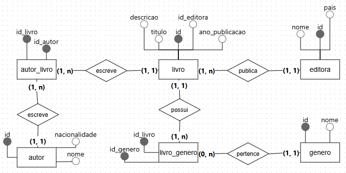

# 📚 Book Registration System

> 🎯 A relational database modeling and implementation project for managing books, authors, publishers, and literary genres.

📗 Este projeto também está disponível em português: [README.md](./README.md)

---

## 🛠️ Technologies Used

- ✅ **SQL** – Data modeling and manipulation
- ✅ **MySQL Workbench** – Logical and physical modeling
- ✅ **MySQL (InnoDB)** – DBMS with referential integrity support
- ✅ **BrModelo** – Conceptual modeling (ERD)

---

## 📄 Project Documentation

| Type                        | File                                                                 |
|----------------------------|----------------------------------------------------------------------|
| 📑 System Requirements      | [`documentos/requirements.pdf`](./documentos/requirements.pdf)           |
| 🧾 Data Dictionary      | [`documents/data_dictionary.pdf`](./documents/data_dictionary.pdf)   |

---

## 🔎 Database Structure

- **Database**: `registro_livros`  
- **Tables**:
  - `editora`  
  - `livro`  
  - `genero`  
  - `autor`  
  - `autor_livro`  
  - `livro_genero`

> 🧠 Follows best practices of normalization (1NF, 2NF, 3NF)

📘 Logical model (editable): [`sql/modelo_logico.mwb`](./sql/modelo_logico.mwb)

---

## 🧠 Modeling

| Type             | Image |
|------------------|--------|
| 🧩 Conceptual Model |  |
| 🧠 Logical Model    |          |

---

## 🧪 SQL Scripts

| Purpose                   | File                                                 |
|---------------------------|------------------------------------------------------|
| 🏗️ Create structure        | [`sql/modelo_fisico.sql`](./sql/modelo_fisico.sql)  |
| 📥 Insert sample data      | [`sql/insercao_dados.sql`](./sql/insercao_dados.sql)|
| 🔎 SQL Queries             | [`sql/queries.sql`](./sql/queries.sql)              |

---

## 🚀 How to Use

1. Open **MySQL Workbench**
2. Run `modelo_fisico.sql` to create the tables
3. Run `insercao_dados.sql` to populate the database
4. Explore the sample queries in `queries.sql`

---

## 💡 Notes

- It’s possible to register authors, publishers, and genres without immediately linking them to books.
- N:N relationships are handled using associative tables:
  - `autor_livro`
  - `livro_genero`
- Data integrity is ensured using the **InnoDB** engine.

---

## 📬 Contact

This project was created for learning purposes. 
📬 Get in touch to talk about data, projects or collaborations!

📧 [patiregina1350@gmail.com](mailto:patiregina1350@gmail.com)

---

## 📝 License

This project is licensed under the **MIT License**.  
Feel free to study, modify, and reuse it with proper credit.

---
