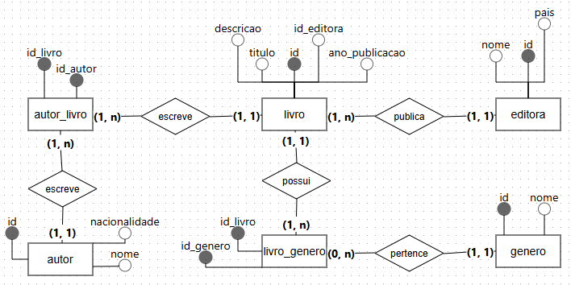
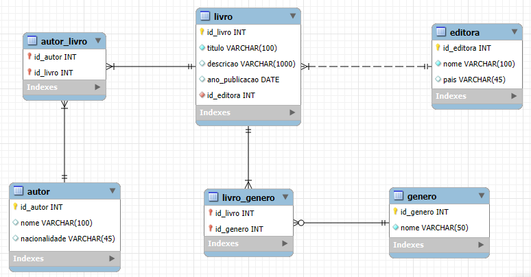

# 📚 Sistema de Registro de Livros
> 🎯 Projeto de modelagem e implementação de banco de dados relacional com procedures para gerenciamento de livros, autores, editoras e gêneros literários.

📘 This project is also available in English: [README-en.md](./README-en.md)

---

## 🛠️ Tecnologias
- **SQL**: Modelagem e manipulação dos dados.
- **MySQL Workbench**: Modelagem lógica e física do banco de dados.
- **MySQL (InnoDB)**: Sistema de gerenciamento de banco de dados utilizado na implementação, com suporte a integridade referencial.
- **BrModelo**: Modelo conceitual (DER).

---

## 📄 Documentos do Projeto

| Tipo                         | Arquivo                                                                 |
|-----------------------------|-------------------------------------------------------------------------|
| 📑 Requisitos do Sistema     | [`documentos/requisitos.pdf`](./documentos/requisitos.pdf)             |
| 📘 Dicionário de Dados       | [`documentos/dicionario_de_dados.pdf`](./documentos/dicionario_de_dados.pdf) |

---

## 🧱 Estrutura do Banco

- **Banco de dados**: `registro_livros`
- **Tabelas**:
  - `editora` 
  - `livro` 
  - `genero` 
  - `autor` 
  - `autor_livro` 
  - `livro_genero`
 
> 🧠 Segue as boas práticas de normalização (1FN, 2FN, 3FN)

📘 Modelo lógico editável: [`sql/modelo_logico.mwb`](./sql/modelo_logico.mwb)

---

## 🧠 Modelagem

| Tipo                | Imagem |
|---------------------|--------|
| 🧩 Modelo Conceitual |  |
| 🧠 Modelo Lógico     |          |

---

## 🧪 Scripts SQL

| Finalidade                 | Arquivo                                               |
|---------------------------|--------------------------------------------------------|
| 🏗️ Criar estrutura         | [`sql/modelo_fisico.sql`](./sql/modelo_fisico.sql)    |
| 📥 Inserir dados de exemplo| [`sql/insercao_dados.sql`](./sql/insercao_dados.sql)  |
| ⚙️ Procedures              | [`sql/procedures.sql`](./sql/procedures.sql)          |
| 🔎 Consultas SQL           | [`sql/queries.sql`](./sql/queries.sql)                |

---

## 🚀 Como Executar

1. Abra o **MySQL Workbench**
2. Execute o script `modelo_fisico.sql` para criar as tabelas
3. Execute `insercao_dados.sql` para popular o banco
4. Explore as consultas no `queries.sql`
5. Execute `procedures.sql` para criar as procedures armazenadas no banco

---

## 🧠 Observações

- É possível cadastrar autores, editoras e gêneros mesmo sem relacioná-los a livros imediatamente.
- Os relacionamentos N:N são resolvidos por meio das tabelas associativas:
  - `autor_livro`
  - `livro_genero`
- A integridade dos dados é garantida com o uso do **InnoDB**.
- **Stored Procedures** foram implementadas para facilitar operações seguras como:
  - Inserção de livros com validações de dados
  - Atualização e exclusão controlada
- Essas procedures garantem a integridade dos dados e simplificam o uso do banco por aplicações externas.

---

## 📬 Contato

Este projeto foi criado com fins de aprendizado.  
📬 Entre em contato para conversar sobre dados, projetos ou colaborações!

📧 E-mail: [patiregina1350@gmail.com](mailto:patiregina1350@gmail.com)

---

## 📝 Licença

Este projeto está sob a licença **MIT**.  
Sinta-se livre para estudar, modificar e reutilizar com os devidos créditos.

---
